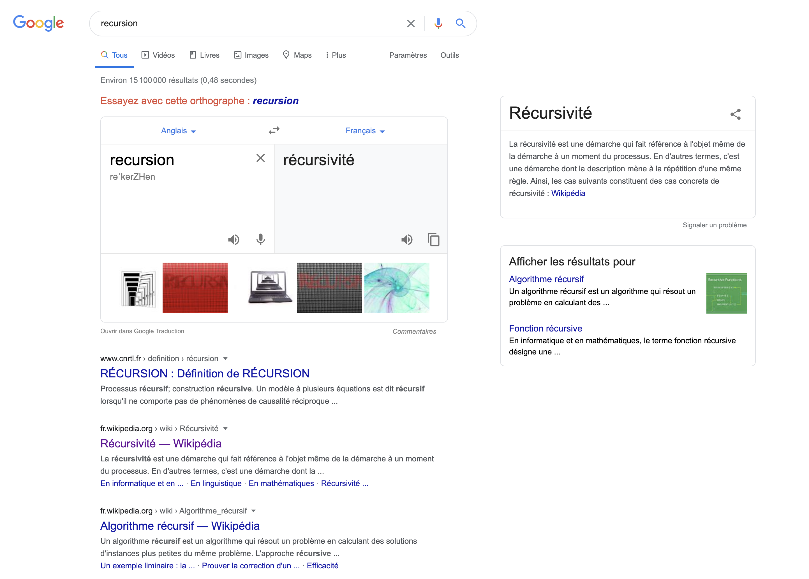

<style type="text/css">
.reveal .footer {
    position: absolute;
    bottom: 0em;
    left: 1em;
    font-size: 0.5em;
  }
</style>
<script type="text/javascript">
</script>

<!-- .slide: data-background="#27457b" -->

# Introduction à la programmation fonctionnelle

#### Stéphane TANKOUA <!-- .element: style="color:pink" -->
#### (github: @stankoua / twitter: @stefshine) <!-- .element: style="color:pink" -->


Note:
 <!-- Summary -->
- Contexte historique
- Qu'est ce que la programmation fonctionnelle
  - fontion
  - pureté
  - effet de bord
- Concepts de base de la programmation fonctionnelle
  - HoF
  - lambda
  - curryfication
  - application partielle
  - closure
  - immutabilité
  - idempotence
  - composition
  - recursivité
- Prototype d'un langage fonctionnel

---

# Pré-requis:

- Bases de la programmation impérative 
- Notions d'algorithmique
- Structures de données
- Notions de compilation
- Une connaissance d'un langage objet (Java)

---

# Et si on remontait le temps (de façon desordonnée)

<!-- .slide: data-background="./7611797.jpg" style="font-color:white;" data-background-position="center" data-background-size="100% 100%" -->

---

# Contexte historique

2 personnages clés:

- Alonzo Church (1930)


---

# Contexte historique

2 personnages clés:

- Alan Turing (1936)


---

# Contexte historique

Un problème avec lequel tout commence: `Problème de l'arrêt`.


> En théorie de la calculabilité, le problème de l'arrêt est le problème de décision qui détermine, 
> à partir d'une description d'un programme informatique, et d'une entrée, si le programme s'arrête 
> avec cette entrée ou non.

---

# Contexte historique

Le problème de l'arrêt a été montré comme étant indécidable, à 2 reprises:

- par Church avec le lambda calcul (programmation fonctionnelle)

- par Turing avec les machines de Turing (programmation impérative)

Les 2 modèles ont été montrés (par Turing et Kleene) comme ayant des capacités équivalentes.

---

# Contexte historique

- idée de calcul effectif, formalisation de la calculabilité

- Toutes les fonctions ne sont pas calculables

- machine de Turing = modèle “abstrait” du fonctionnement d’un ordinateur

- À la date d’aujourd’hui, les modèles de calcul pour décrire les algorithmes sont encore ceux-ci

---

# Contexte historique

1er langage de programmation (impératif):
- Fortran (1956 par John Backus)

1er langage de programmation fonctionnel:
- Lisp (1958 par John McCarthy)

---

# Contexte historique

Une pléaide de langages après:

- impératifs:
  - C, C++, Java, Python, Javascript, Scala ...

- Fonctionnels:
  - Scheme, ML, Ocaml, Erlang, Haskell, F#, Scala ...

---

# Pourquoi les langages impératifs sont-ils plus utilisés ?

Réponse courte: Merci à John Von Neumann

---

# Pourquoi les langages impératifs sont-ils plus utilisés ?

Réponse Longue: 
- Von Neumann élabore en 1945 une architecture pour les ordinateurs

- inspire de nombreux ordinateurs construits à l'époque (notamment IBM)

- La programmation impérative est plus efficace pour cette architecture

- les propositions d'architecture concurrentes furent oubliées (Lisp machine)


---

# Pourquoi les langages impératifs sont-ils plus utilisés ?

Pourquoi les langages impératifs sont plus efficaces sur l'architecture de Von Neumann ?

Compilation / interprétation
= 
passer d'un langage de haut niveau à un langage de plus bas niveau
=
passage de langage lisible par un humain à un langage compréhensible par la machine

---

# Pourquoi les langages impératifs sont-ils plus utilisés ?

Langages impératifs: reproduisent l'architecture de Von Neumann

Langages fonctionnels: abstraient l'architecture de Von Neumann (souvent besoin d'un langage intermédiaire)

On le verra plus en détails dans la suite du cours

---

# Retour vers le futur

<!-- .slide: data-background="./7611797.jpg" style="font-color:white;" data-background-position="center" data-background-size="100% 100%" -->

---

# Qu'est ce que la programmation fonctionnelle

<!-- .slide: data-background="#27457b" -->

---

# Qu'est ce que la programmation ?

Programmation = création du code source d'un logiciel

Plusieurs étapes: 
- conception
- écriture (du code source dans un langage de programmation)
- compilation / vérification de son exactitude

---

# Qu'est ce que la programmation impérative ?

Le programme se compose de:
- Une liste d'instructions à exécuter
- Les variables sont des espaces mémoire
- Les instructions peuvent modifier des variables
- La machine se programme par effets de bords (= modifications de l’état général de la machine (mémoire, etc.))

```c
void strcpy(char *s, char *t)
{
    while (*t != '\0') {
        *s = *t;
        s = s + 1;
        t = t + 1;
    }
    *s = *t;
}
```

---

# Qu'est ce que la programmation fonctionnelle ?

Un concept central: la *fonction*.

> La programmation fonctionnelle est un paradigme de programmation de type déclaratif qui considère le calcul en tant qu'évaluation de fonctions mathématiques.

Qu'est ce qu'une fonction ?

> En mathématiques, une fonction permet d'obtenir un résultat à partir d'une valeur passée en entrée de celle-ci.

---

# Qu'est ce que la programmation fonctionnelle ?


Une fonction peut être considéré comme une **"boîte noire"**.

Quelques examples de fonctions:

```
f: x -> x + 1

g: x -> x
```

---

# Qu'est ce que la programmation fonctionnelle ?

Qu'est ce que cela implique ?

- une fonction ne modifie pas ses arguments (entrées immutables)

- une fonction ne fait (**en principe**) rien d'autre que déterminer son résulat, on dit qu'elle est **pure**

- une fonction peut être nommée

- une fonction retourne (**presque toujours**) une valeur

- une fonction est (**en principe**) une **expression**

NB: Une expression est un élément de syntaxe d'un langage qui combine un ensemble de "termes" retournant une valeur.

---

# Qu'est ce que la programmation fonctionnelle ?

Qu'est ce que cela implique ?

- Plus d’instructions, plus d’espaces mémoire, plus d’effets de bord

- Uniquement des expressions

- L’affectation n’existe plus ! (`n = n + 1`)

- Les expressions se réduisent en des valeurs
  - entiers, réels, booléens, fonctions

- Les fonctions sont des valeurs comme les autres

- On peut nommer les valeurs (par des noms symboliques)

---

# Qu'est ce que la programmation fonctionnelle ?

Qu'est ce qu'une **fonction pure** ? 

Trois critères à respecter:

- La valeur de retour est la même pour les mêmes arguments, càd pas de variation avec des variables ou des arguments mutables.

- Son évaluation n'a pas d'**effets de bord** (pas de mutation de variables, d'arguments mutables).

- La fonction est **référentiellement transparente**.

---

# Qu'est ce que la programmation fonctionnelle ?

Qu'est ce q'un effet de bord ? 

> Un effet de bord est une opération qui change l'état global visible d'un programme. 
> Typiquement, il s'agit d'affectation d'une variable, qu'elle soit globale ou locale (ou même statique).
> On compte également parfois les entrées/sorties dans les effets de bord.


Exemple:

```java
String modifieChaine(String input) {
  input = input + ".";
  return "Chaine de caractères d'entrée: " + input;
}
```

```java
String imprimeChaine(String input) {
  System.out.println(input);
  return "Chaine de caractères d'entrée: " + input;
}
```

---

# Qu'est ce que la programmation fonctionnelle ?

Une fonction pure respectera aussi le critère de transparence référentielle:

> Une fonction est reférentiellement transparente si, dans le programme, on peut remplacer l'appel à cette fonction
> par le résultat de l'appel à cette dernière sans que cela ne change le comportement du programme.

NB: Les effets de bord cassent le transparence référentielle.

---

# Qu'est ce que la programmation fonctionnelle ?

Quizz 1:

```java
String maFonction(int input) {
  for(int i = 0; i <= input; i++) {
    input--;
    if (input == i)
      return "Fini" ;
  }
}
```

`maFonction` est-elle référentiellement transparente ?

---

# Qu'est ce que la programmation fonctionnelle ?

Quizz 2:

```java
String maFonction(int input) {
  for(int i = 0; i <= input; i++) {
    System.out.println(i);
  }
  return "Fini";
}
```

`maFonction` est-elle référentiellement transparente ?

---

# Qu'est ce que la programmation fonctionnelle ?

Quizz 3:

```java
int maFonction(int input) {
  var somme = 0;
  for(int i = 0; i <= input; i++) {
    somme = somme + i;
  }
  return somme;
}
```

`maFonction` est-elle référentiellement transparente ?

---

# Qu'est ce que la programmation fonctionnelle ?

Quizz 4:

```java
void boiteNoire(int input) {
  ...
}

int maFonction(int input) {
  boiteNoire(input);
  return input;
}
```

`maFonction` est-elle référentiellement transparente ?

---

# Qu'est ce que la programmation fonctionnelle ?

Quizz 5:

```java
import java.util.*;

String maFonction(int input) {
  Scanner scanner = new Scanner(System.in);
  String result = scanner.nextLine();
  scanner.close()
  return result;
}
```

`maFonction` est-elle référentiellement transparente ?

---

# Qu'est ce que la programmation fonctionnelle ?

Quizz 6:

```java
int maFonction(int input) {
  byte x = -1;
  int x2 = ((int)x) & 0xff;
  for(int i = 0; i < 8; i++) {
    x2 = (x2 >>> 1);
  }
  return x2;
}
```

`maFonction` est-elle référentiellement transparente ?

---

# Qu'est ce que la programmation fonctionnelle ?

Quizz 7:

```java
int maFonction(int input) {
  return  10 / input;
}
```

`maFonction` est-elle référentiellement transparente ?

---

# Qu'est ce que la programmation fonctionnelle ?

Quizz 8:

```java
int maFonction(int input) {
  try {
    throw new RuntimeException
  } catch (Exception ex) {}
  return  input * 2;
}
```

`maFonction` est-elle référentiellement transparente ?

---

# Qu'est ce que la programmation fonctionnelle ?

Quizz 9:

```java
int global = 1;

void function() {
  while (global < 1000)
    global++;
}

int maFonction(int input) {
  return  input * global;
}
```

`maFonction` est-elle référentiellement transparente ?

---

# Qu'est ce que la programmation fonctionnelle ?

Quizz 10:

```java
final int global = 1;

int maFonction(int input) {
  return  input * global;
}
```

`maFonction` est-elle référentiellement transparente ?

---

# Qu'est ce que la programmation fonctionnelle ?

Pour résumer

- Nous avons défini la programmation fonctionnelle comme le fait de programmer avec des expressions.

- On peut les déclarer, les passer en paramètre et les retourner.

- Les expressions permettent d'obtenir des valeurs: entiers, réels, booléens, fonctions.

- Les fonctions sont pures.

---

# Concepts de base de la programmation fonctionnelle

<!-- .slide: data-background="#27457b" -->

---

# Fonctions d'ordre supérieur

Jusqu'à présent, nous avons défini une fonction comme une expression:
- prenant en paramètre une valeur (entiers, booléens, `string`...)
- et retournant une valeur (entiers, booleéns, `string`)

Une fonction peut-elle être considérée comme une valeur ?

NB: On dit d'une valeur qu'il est un citoyen de 1er ordre (d'un langage de programmation).

---

# Fonctions d'ordre supérieur

Une fonction est une valeur en programmation fonctionnelle.

Qu'est ce que cela implique ?

- Une fonction peut être assignée à une variable

```haskell
f: x -> x + 1

variable = f

f(1)        -- > 2
variable(1) -- > 2
```

---

# Fonctions d'ordre supérieur

Une fonction est une valeur en programmation fonctionnelle.

Qu'est ce que cela implique ?

- Une fonction peut être retournée par une fonction

```haskell
f: x -> (y -> y * x)

addOne = f(1) -- > addOne: x -> x + 1

addOne(2) -- > 3
```

---

# Fonctions d'ordre supérieur

Une fonction est une valeur en programmation fonctionnelle.

Qu'est ce que cela implique ?

- Une fonction peut être passée en paramètre d'une fonction

```haskell
f: g -> g(1) * 2

higherOrder = f(x -> x + 1) -- > 4
```

---

# Fonction anonymes

Nous avons défini des fonctions nommées:

```haskell
f: x -> x + 1

f(1)
```

Nous savons que le nom `f` fait référence à la fonction `x + 1`

---

# Fonction anonymes

Il est possible d'avoir des fonctions qui ne sont pas nommées (ou fonction `lambda`).
En reprenant l'exemple des fonctions d'ordre supérieur:

```haskell
f: g -> g(1) * 2

higherOrder = f(x -> x + 1) -- > 4
```

En implémentant `higherOrder` nous passons à `f` une fonction anonyme. 

---

# Curryfication

En prenant l'exemple:

```haskell
f: x -> (y -> y + x)

addOne = f(1) -- > addOne: x -> x + 1

addOne(2) -- > 3
```

`addOne(2)` est équivalent à `f(1)(2)`.
`f` retournant une fonction, il faut lui appliquer un paramètre pour obtenir le résultat final.
`f` peut-être considérée comme une fonction à 2 arguments, mais elle les prend l'un après l'autre.

On dit que `f` est **curryfiée**.

---

# Application partielle

Prenons l'exemple suivant:

```haskell
f: (x, y) -> y + x

f(1, 2) -- > 3

g: x -> f(1, x)

g(2) -- > 3
```

`f` est une fonction à 2 arguments, nous lui passons les 2 paramètres quand nous l'appelons.
`g` applique à `f` le 1er paramètre (`1`), et réduit son nombre de paramètre.

On dit que `f` est **partiellement appliquée** lors de l'implémentation de `g`.

---

# Closures

Prenons l'exemple suivant:

```haskell
variable1 = 1000

variable2 = 2

f: x -> x * variable1 / variable2
```

La fonction `f` prend en paramètre `x`, on dit que la variable `x` est **liée** 
car elle n'existe pas hors du scope de `f`. A contrario `f` fait référence aux variables 
`variable1` et `variable2` qui ne sont pas dans son scope. Les variables `variable1` et 
`variable2` sont dites **libres**.

La fonction `f` "capture" dans son "environnement" les variables libres (nom + valeur).
On dit que `f` est une **closure** (ou **fermeture** en français).

---

# Closures

Quizz: Si je modifie une variable capturée dans l'environnement d'une closure à l'extérieur de celle-ci ?

---

# Immutabilité

L’immutabilité consiste à ne pas permettre le changement d’état.

En `Java`, une variable déclarée avec `final` ne peut pas voir son état modifié.

Par contre l'instruction `x = x + 1` modifié l'état de la variable.

Nous avons évoqué d'éviter la mutabilité des paramètres d'entrées (effet de bord):

```java
String modifieChaine(String input) {
  input = input + ".";
  return "Chaine de caractères d'entrée: " + input;
}
```

---

# Immutabilité

Nous avons évoqué d'éviter la mutabilité de variables hors du scope (effet de bord):

```java
int global = 1;

void function() {
  while (global < 1000)
    global++;
}

int maFonction(int input) {
  return  input * global;
}
```

`global` est un état mutable partagé, sa modification a un impact sur le résultat de `maFonction`.
2 exécutions de `maFonction` pour le même argument d'entrée peuvent retourner 2 valeurs différentes.

---

# Immutabilité

Par contre la mutabilité locale peut être tolérée:

```java
int maFonction(int input) {
  var somme = 0;
  for(int i = 0; i <= input; i++) {
    somme = somme + i;
  }
  return somme;
}
```

`maFonction` a un état mutable local (càd non partagé). Hors de `maFonction`, il n'est pas possible de savoir 
qu'il y'a une modification d'un état mutable. De plus en appelant `maFonction` avec le même paramètre, nous
aurons le même résultat.

---

# Immutabilité 

Nous pouvons avoir des cas de mutabilité observable dans un contexte immutable:

```java
import java.util.Random;

public class IntGenerator {
    private final static Random RANDOM = new Random();
    int generate() {
        return RANDOM.nextInt();
    }
}
```

La méthode `generate` de `IntGenerator` renvoie un résultat différent à chaque appel.
Son implémentation est immutable, pourtant `nextInt` de `RANDOOM` modifie un état partagé (le seed).

---

# Idempotence

Idempotence: même entrée => même résultat

Notre fonction d'incrément est idempotente:

```haskell
f: x -> x + 1

f(1) == f(1)
```

En reprenant l'exemple du generateur:

```java
import java.util.Random;

public class IntGenerator {
    private final static Random RANDOM = new Random();
    int generate() {
        return RANDOM.nextInt();
    }
}
```

`generate` par contre n'est pas idempotente (et on s'en doute en voyant la signature).

---

# Composition

Une idée simple: 
> à partir de deux fonctions, on peut construire une nouvelle fonction
> en passant le résultat de la 1ère à la 2nde

```haskell
-- la composition en 1 mot revient à:
f(g(input))
```

---

# Composition

Exemple: Nous voulons une fonction pour calculer le double de l'incrément d'un nombre passé en entrée, 
sachant que nous avons une fonction pour incrémenter un nombre et une fonction qui double son entrée.

```haskell
-- nous avons une fonction qui calcule la taille d'une chaîne de caractères
incremente: x -> x + 1

-- nous avons une fonction qui double la valeur passé en entrée
double: x -> x * 2

doubleIncrement: x -> double(taille(x))
```

Quizz:
- Sous quelle condition `doubleIncrement` est référentiellement transparente ? pure ?
- A partir d'une fonction `decremente: x -> x - 1` et de la fonction `divide: x -> 10 / x`, pouvons nous écrire une fonction pure composant les 2 ? 

---

# Recursivité

> La récursivité consiste à définir quelque chose à partir d'elle même.

Un exemple en français: 

> Un truc est un truc

`Truc` est défini à partir de lui-même

---

# Recursivité

La programmation fonctionnelle est un style déclaratif,
on veut donc décrire nos traitements sans entrer dans les détails d'implémentation.

```java
public long factorial(long n) {
    long result = 1;
    for(long i = 2; i<=n; ++i) {
        result *= i;
    }
    return result;
}
```

Détails "inutiles" avec cette implémentation impérative:
- la déclaration d'une variable intermédiaire (`result`)
- iteration, boucle `for`

---

# Recursivité

On peut définir cette fonction de façon déclarative, avec une définition récursive:

```java
public long factorial(long n) {
  if (n < 2)
    return 1;
  else
    return n * factorial (n - 1);
}
```

Deux remarques:
- `factorial` s'appelle elle même dans son implémentation, elle est récursive.
- On décrit le traitement, la machine s'occupe de faire l'itération.

---

# Recursivité

Deux cas à distinguer avec la récursivité:
- la **récursivité terminale**: aucune instruction n’est exécutée après l’appel à soi-même 

```java
void f(int n){
  if(n==0) System.out.println("Hello");
  else f(n-1);
}
```

---

# Recursivité

Deux cas à distinguer avec la récursivité:
- la **récursivité non terminale**: si elle n'est pas terminale

```java
void f(int n) {
  if(n>0) f(n-1);
  System.out.println("Hello");
}
```

---

# Recursivité

Deux autres catégories de fonctions récursives:
- la **récursivité directe**: si elle la fonction s'appelle elle-même

```java
void f(int n) {
  if(n>0) f(n-1);
  System.out.println("Hello");
}
```

NB: `f` est recursive non-terminale directe.

---

# Recursivité

**Récursivité directe** et Google:




---

# Recursivité

Deux autres catégories de fonctions récursives:
- la **récursivité indirecte**: si une fonction `f` appelle `g` qui appelle `f` à son tour

```java
void f(int n) {
  if(n%2 == 0) g(n-1);
  else System.out.println("Hello");
}

void g(int n) {
  if(n%2 == 1) f(n-1);
  else System.out.println("World");
}
```

---

# Recursivité

**Récursivité indirecte** et humour à la télé:


---

# Recursivité

Quizz: La fonction suivante est-elle correcte ? Que fait-elle ?

```java
public long f(long n) {
  if (n == 1) return n;
  else return f(n - 1);
}
```

---

# Recursivité

Quizz: La fonction suivante est-elle correcte ? Que fait-elle ?

```java
public long f(long n) {
  return f(n - 1);
}
```

---

# Recursivité

Attention lors de la définition d'une fonction récursive.
Une condition de terminaison doit être fournie:

```java
public long factorial(long n) {
  if (n < 2)
    return 1;
  else
    return n * factorial (n - 1);
}
```

La condition `n < 2` met fin à la récursion.
Sans condition de fin, la récursion pourrait être infinie.

---

# Recursivité

En faisant un parallèle avec une itération (impérative):

```java
public long factorial(long n) {
  long result = 1;
  for(long i = 2; i<=n; ++i) {
      result *= i;
  }
  return result;
}
```

La condition `i <= n` met fin à l'itération.
Sans condition de fin, l'itération pourrait être infinie.

---

# Recursivité

Quizz: Avec l'implémentation suivante de `factorial`, sommes-nous sûr que la récursion 
soit toujours finie ? Sinon, comment pouvons-nous faire qu'elle soit finie ?

```java
public long factorial(long n) {
  if (n < 2)
    return 1;
  else
    return n * factorial (n - 1);
}
```

---

# Recursivité

Quizz: En nous inspirant de `factorial`, pouvons donner un critère que
doit respecter la récursion afin de s'assurer qu'elle ne soit pas infinie ?

```java
public long factorial(long n) {
  if (n < 2)
    return 1;
  else if (n < 0)
    if (n % 2 == 0) return -1 * factorial(n);
    else factorial(n);
  else
    return n * factorial (n - 1);
}
```

---

# Recursivité

Quizz: Pouvons-nous automatiser (via un algorithme) la prédiction qu'une fonction termine ou pas ?

---

# Recursivité

> Il n’existe pas de moyen automatique pour savoir si un programme termine ou pas.

---

# Recursivité

Est-il toujours possible de passer d'une iteration impérative à une récursion ?

> Pour une boucle `for` c'est trivial.

```java
public long factorial(long n) {
    long result = 1;
    for(long i = 2; i<=n; ++i) {
        result *= i;
    }
    return result;
}
```

---

# Recursivité

Est-il toujours possible de passer d'une iteration impérative à une récursion ?

> Pour une boucle `for` c'est trivial.

```java
public long factorial(long n) {
  if (n < 2) return 1;
  else return n * factorial (n - 1);
}
```

---

# Recursivité

Quizz: Proposer une version récursive de la fonction suivante:

```java
void f(int n) {
  for (int i=0; i<=n; i++)
    traitement(i);
}
```

---

# Recursivité

De manière générale, pour traduire:

```java
// Itératif
void f(int n) {
  for (int i=0; i<=n; i++)
    traitement(i);
}

// Fonctionnel
void f(int n){
  if(n==0) traitement(0);
  else {
    f(n-1);
    traitement(n);
  }
}
```

---

# Recursivité

Quizz: La fonction `factorial` est-elle recursive terminale ? Pourquoi ?

```java
public long factorial(long n) {
  if (n < 2) return 1;
  else return n * factorial (n - 1);
}
```

---

# Recursivité

Pour résumer:
- Les formes récursives sont plus faciles à écrire que les fonctions itératives
- La plupart des traitements itératifs simples (boucles `for`) peuvent se mettre sous forme récursive
- L'inverse est faux.

---

# Prototype d'un langage fonctionnel

Ce que nous avons dit sur la programmation fonctionnelle:

- La programmation fonctionnelle est le fait de programmer avec des expressions.

- On peut les déclarer, les passer en paramètre et les retourner.

- Les expressions permettent d'obtenir des valeurs: entiers, réels, booléens, fonctions.

- Les valeurs peuvent être nommées.

- Les fonctions sont pures.

---

# Prototype d'un langage fonctionnel

Pouvons-nous à partir de cela définir un mini pseudo-langage fonctionnel ?

> Les valeurs peuvent être nommées.
> Les expressions permettent d'obtenir des valeurs: entiers, réels, booléens, fonctions.

Dans notre langage, qu'aurions-nous ?

```haskell
-- <variable> = <valeur>
x = 1
x = "bonjour"
x = True
x = y -> y + 1
```

---

# Prototype d'un langage fonctionnel

Pouvons-nous à partir de cela définir un mini pseudo-langage fonctionnel ?

> On peut les déclarer, les passer en paramètre et les retourner.

Dans notre langage, qu'aurions-nous ?

```haskell
f = x -> x +  1
g = f -> f(2) +  1
h = x -> (y -> y + 1)

-- <expression> = <expression> <expression>
```

---

# Prototype d'un langage fonctionnel

Pouvons-nous à partir de cela définir un mini pseudo-langage fonctionnel ?

> On peut les déclarer, les passer en paramètre et les retourner.

Dans notre langage, qu'aurions-nous ?

```
<valeur> : int | string | boolean | ...
<variable> = <valeur>
<function> = (<variable>) -> <expression>
<expression> = <variable> | <valeur> | <function> | <function>(<expression>)
```

NB: Cette forme d'un langage fonctionnel a été donnée pour la 1ère fois par Church (1930)
sous le nom de lambda-calcul.

---

# Prototype d'un langage fonctionnel

Quizz: Pouvons-nous établir un lien entre fonction et valeur ? 
càd: 
- une fonction peut-elle être une valeur ?
- une valeur peut-elle être une fonction ?

Qu'est ce que cela impliquerait sur notre mini pseudo-langage fonctionnel ci-dessus ?

Quelles modifications lui apporteriez-vous ?

---

# Prototype d'un langage fonctionnel

Etant donné qu'une fonction est une valeur (et une abstraction sur une valeur), on aurait donc:

```
<valeur> : int | string | boolean | <function> | ...
<variable> = <valeur>
<function> = (<variable>) -> <expressioon>
<expression> = <variable> | <valeur> | <function>(<expression>)
```

---

# Prototype d'un langage fonctionnel

Notre langage, appellons le `funk`, est un langage fonctionnel pur.
Car nos fonctions sont pures.

Est-il obligatoire qu'un langage soit pur ?

Si oui comment ferons-nous de l'I/O ? Comment gérer les erreurs ?

---

# Prototype d'un langage fonctionnel

Comment les langages fonctionnels ont-il répondu à la question ?

Des choix différents ont été fait selon les langages:
- haskell:
  - ne supporte pas: pas de mutation, pas d'effets de bord
  - supporte: les exceptions (mais peu conseillé)
- Ocaml, Lisp, Scala:
  - supporte: mutabilité, effet de bord, I/O (impure)

Ces langages supporte les capacités de notre mini-langage.

Remarques:
- Lisp est dynamique, alors que Scala et Ocaml sont statiquement typés.
- Haskell propose une fonction pure de faire de l'I/O, la mutabilité, et des effets de bord

---

# Prototype d'un langage fonctionnel

Mais nous avons souvent besoin de traitement supplémentaires dans nos langages de tous les jours, par ex un `if`. Pouvons-nous supporter cela dans notre langage ? Assez simplement:

```
<valeur> : int | string | boolean | <function> | ...
<variable> = <valeur>
<function> = (<variable>) -> <expression>
<expression> = <variable> | <valeur> | <function>(<expression>) | if <condition> then <expression> else <expression>
```

Quelle différence y'a-t-il entre notre `if` et celui d'un langage comme `Java` ?

---

# Fin

## Des questions ?

<!-- .slide: data-background="#27457b" -->
